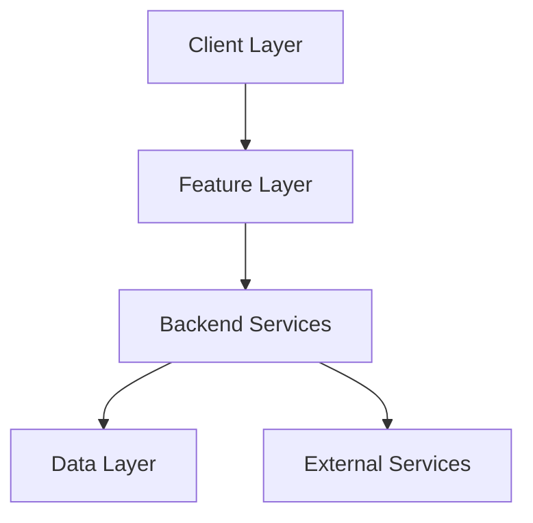

# 🏞️ ZenTrail

  
   
  

    <strong>Your AI-Powered National Parks Companion</strong>
  

  

    <a href="#features">Features</a> •
    <a href="#architecture">Architecture</a> •
    <a href="#tech-stack">Tech Stack</a> •
    <a href="#getting-started">Getting Started</a> •
    <a href="#api-reference">API Reference</a>
  

## 🌟 Overview

ZenTrail is an innovative web application designed to enhance your national parks experience. It combines the power of AI with comprehensive park data to help you plan, explore, and make the most of your outdoor adventures.

### 🎯 Key Features

#### 🗺️ Interactive Park Exploration
- Real-time park visualization with interactive maps
- Detailed trail information and difficulty ratings
- Comprehensive park boundaries and points of interest
- Custom markers for trails, campgrounds, and facilities

#### 🤖 AI Travel Assistant
- Personalized trip recommendations
- Natural language interaction for park queries
- Contextual information about park features
- Smart itinerary planning suggestions

#### 🏕️ Campground Management
- Real-time campsite availability
- Detailed amenity information
- Accessibility features
- Site-specific regulations and guidelines

#### 📊 Park Analytics
- Visitor statistics and peak times
- Trail popularity metrics
- Weather patterns and best visit times
- Seasonal attraction highlights

## 🏗️ Architecture

Our system follows a modern, scalable architecture:

### System Components

- **Frontend**: React-based SPA with TypeScript
- **Backend**: Express.js REST API & Python FastAPI
- **AI Engine**: Google Gemini integration
- **Data Storage**: MongoDB Atlas & Vector Store
- **Maps**: Leaflet with OpenStreetMap

## 🛠️ Tech Stack

### Frontend
- React 18 with TypeScript
- TailwindCSS for styling
- Leaflet for maps
- React Router for navigation

### Backend
- Node.js with Express
- Python FastAPI for AI services
- JWT authentication
- MongoDB Atlas

### AI & Data
- Google Gemini AI
- Vector embeddings for semantic search
- GeoJSON for spatial data
- National Park Service API integration

## 🚀 Getting Started

### Prerequisites
- Node.js (v18+)
- Python 3.10+
- MongoDB Atlas account
- Google Gemini API key

### Installation

1. **Clone the repository**
\`\`\`bash
git clone https://github.com/yourusername/zentrail.git
cd zentrail
\`\`\`

2. **Install Frontend Dependencies**
\`\`\`bash
cd zentrail
npm install
\`\`\`

3. **Install Backend Dependencies**
\`\`\`bash
cd ../backend
npm install
cd ../backend-python
pip install -r requirements.txt
\`\`\`

4. **Environment Setup**
Create .env files in both frontend and backend directories:

Frontend (.env):
\`\`\`env
VITE_API_URL=http://localhost:5002
VITE_GEMINI_API_KEY=your_gemini_api_key
\`\`\`

Backend (.env):
\`\`\`env
MONGODB_URI=your_mongodb_uri
JWT_SECRET=your_jwt_secret
NPS_API_KEY=your_nps_api_key
\`\`\`

5. **Start the Development Servers**

Frontend:
\`\`\`bash
cd zentrail
npm run dev
\`\`\`

Backend:
\`\`\`bash
cd backend
npm run dev
cd ../backend-python
uvicorn main:app --reload
\`\`\`

## 📚 API Reference

### Authentication Endpoints
- `POST /api/auth/signup` - Create new user account
- `POST /api/auth/login` - User login
- `GET /api/auth/verify` - Verify JWT token

### Park Services
- `GET /api/parks` - List all national parks
- `GET /api/parks/:parkCode` - Get specific park details
- `GET /api/park-boundaries/:parkCode` - Get park boundary data

### Trail Services
- `GET /api/trails/:parkCode` - Get park trails
- `GET /api/trails/:trailId` - Get specific trail details
- `GET /api/trails/search` - Search trails by criteria

### Campground Services
- `GET /api/campgrounds/:parkCode` - List park campgrounds
- `GET /api/campgrounds/:id` - Get campground details
- `GET /api/campgrounds/search` - Search campgrounds

### AI Assistant Endpoints
- `POST /api/ai/chat` - Chat with AI assistant
- `POST /api/ai/recommend` - Get AI recommendations
- `POST /api/ai/analyze` - Analyze trip plans

## 🔐 Security

- JWT-based authentication
- Rate limiting on API endpoints
- Input validation and sanitization
- Secure password hashing
- CORS protection

## 📱 Responsive Design

ZenTrail is fully responsive and works seamlessly across:
- 💻 Desktop browsers
- 📱 Mobile devices
- 📲 Tablets
- 🖥️ Large displays

## 🤝 Contributing

We welcome contributions! Please see our [Contributing Guidelines](CONTRIBUTING.md) for details.

1. Fork the repository
2. Create your feature branch
3. Commit your changes
4. Push to the branch
5. Create a Pull Request

## 📄 License

This project is licensed under the MIT License - see the [LICENSE](LICENSE) file for details.

## 👥 Team

- John Doe - Frontend Developer
- Jane Smith - Backend Developer
- Alex Johnson - AI Engineer
- Sarah Wilson - UX Designer

## 📞 Support

For support, email support@zentrail.com or join our Slack channel.

---

  Made with ❤️ by the ZenTrail Team

